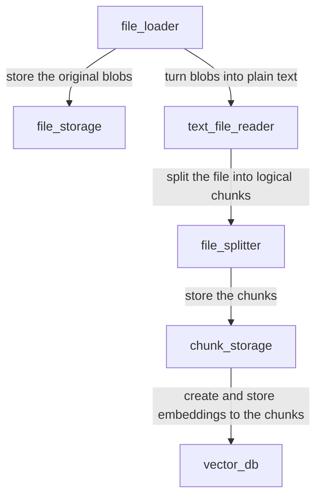

## Add File

```mermaid
flowchart TD
    
    file_loader -- store the original blobs --> file_storage
    file_loader -- turn blobs into plain text --> text_file_reader
    text_file_reader -- split the file into logical chunks --> file_splitter
    
%%    text_file_reader -- load the file into plain text --> file_loader
    file_splitter -- store the chunks --> chunk_storage
    chunk_storage -- create and store embeddings to the chunks --> vector_db
```

## Get File
## Query
