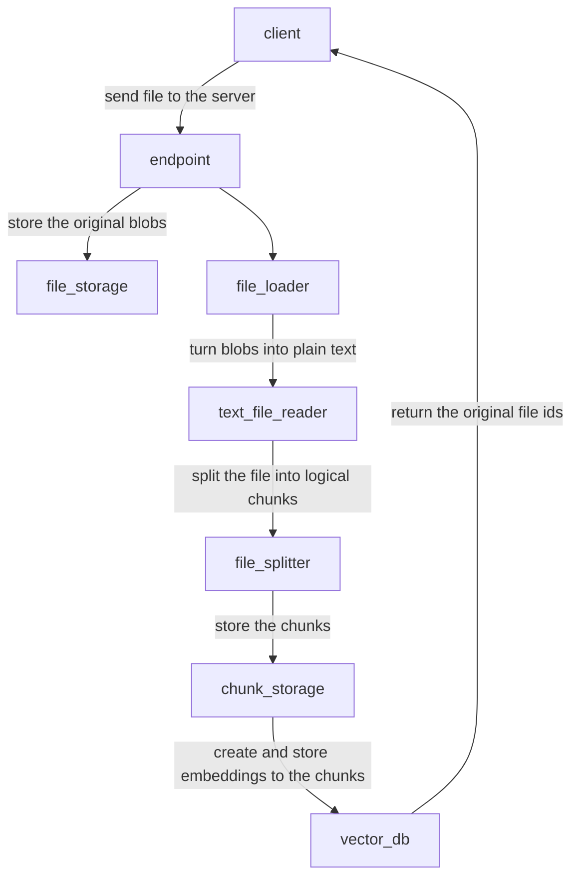
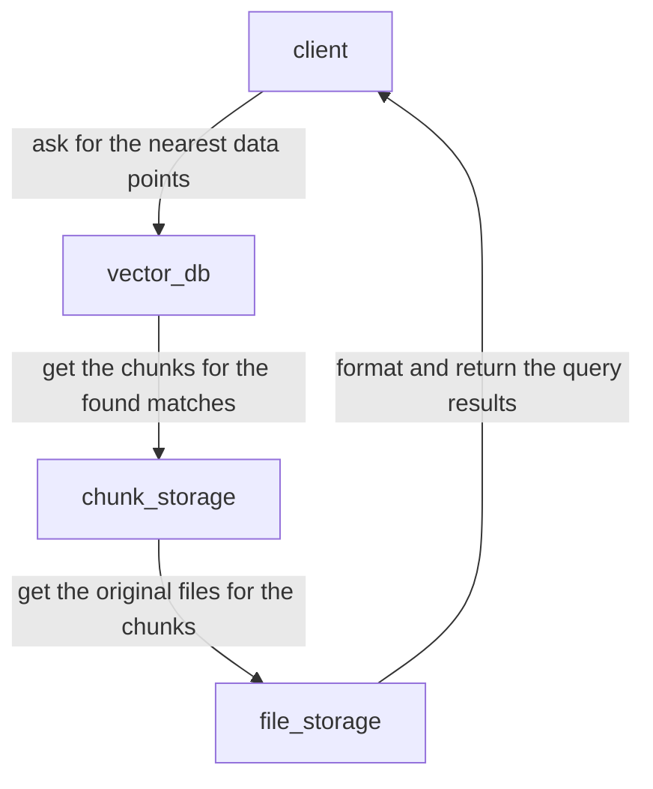

# MVP

This document details how our Minimum Viable Product (MVP) functions, focusing on the processes for adding files and querying stored data. It includes flowcharts to illustrate how data moves through the different parts of our system, providing a clear understanding of the MVP's business logic. 

## Add File

## Get File

## Query

