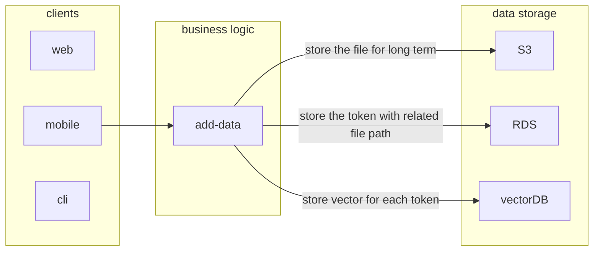
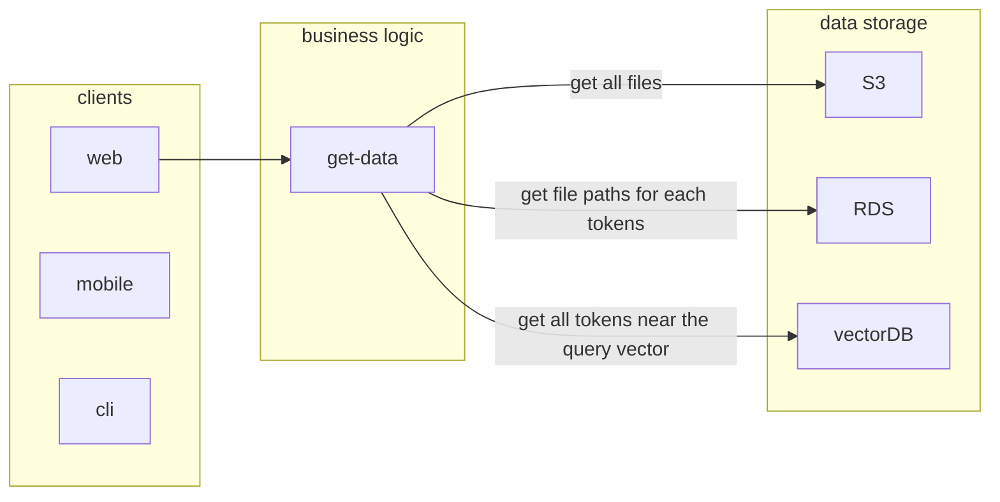

# The aricma Knowledge Graph

The aricma Knowledge Graph is an innovative data management solution designed to address the challenges of changing file storage methods, data search and retrieval, featuring a flexible storage structure, and intelligent indexing.

## Index
1. [About The Problem](documentation/about-the-problem.md): Overview of the challenges related to data storage and retrieval.
2. [Our Solution Finding Strategy](documentation/our-solution-strategy.md): Explanation of the strategic approach to discovering solutions.
3. [Possible User Stories](documentation/possible-user-stories.md): User stories outlining various functionalities and requirements.

